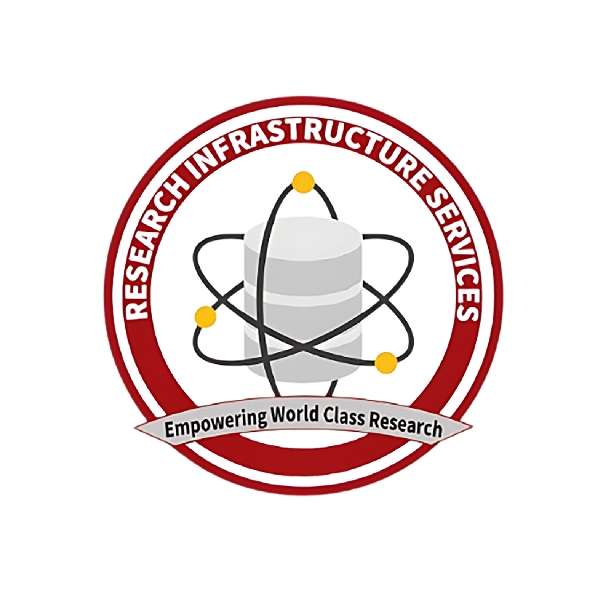

# Intermediary-Compute

This is the repository for the RIS seminar series, Intermediary Compute. If you are looking for more knowledge beyond beginner level, this is the place for you.

## Further Training with Containers

This seminar is an introduction to what containers are and using them and focuses on Docker development.

## Further Training with HPC Tools

This seminar goes over the tools generally used in relation to HPC analysis, including but not limited to Git, workflows like Nextflow, job schedulers, and self checkpointing.

## Further Training with Troubleshooting

This seminar goes into what troubleshooting is and how you can use it while doing your analysis.

## Further Training with HPC Environments

This seminar goes into what environments are and how they relate to HPC analysis and how to use them.

## Fall 2024 Schedule
|Date|Time|Topic|
|----|-----|---------|
|09/05/2024 | 1pm - 2:30pm | Further Training with Containers |
|09/12/2024 | 1pm - 2:30pm | Further Training with HPC Tools |
|09/19/2024 | 1pm - 2:30pm | Further Training with Troubleshooting |
|09/26/2024 | 1pm - 2:30pm | Further Training with HPC Environments |
