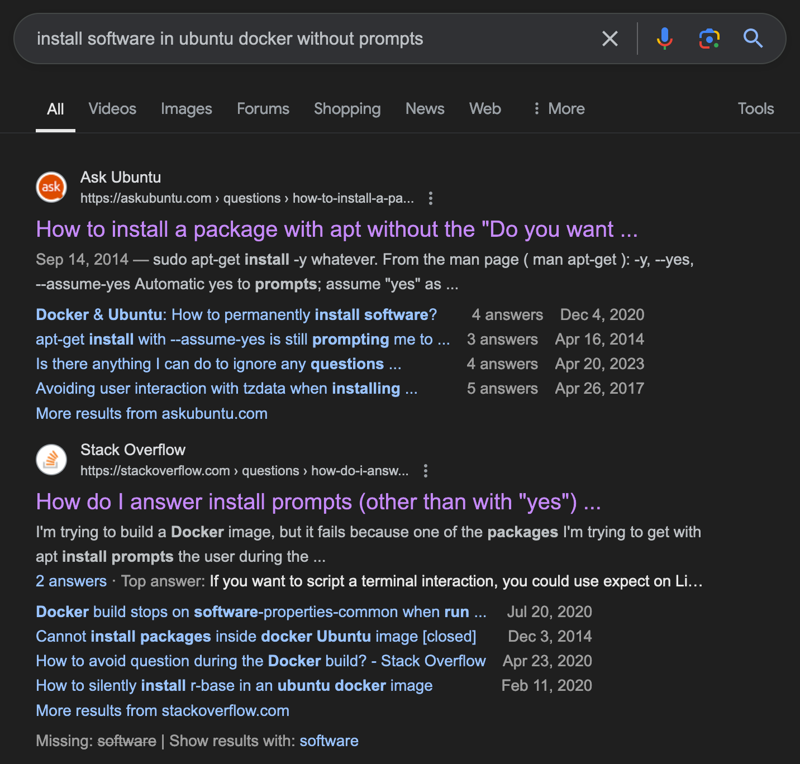
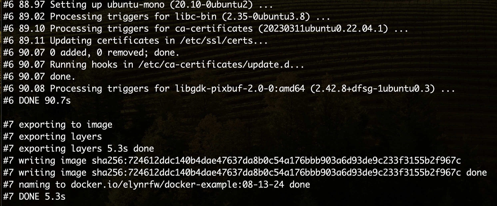
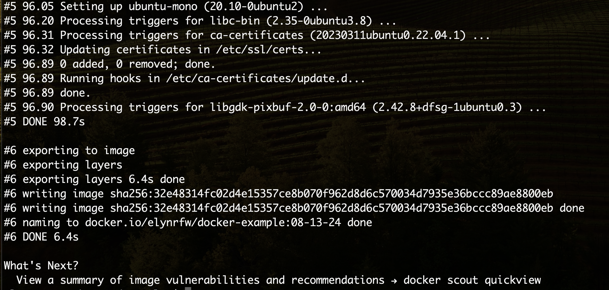
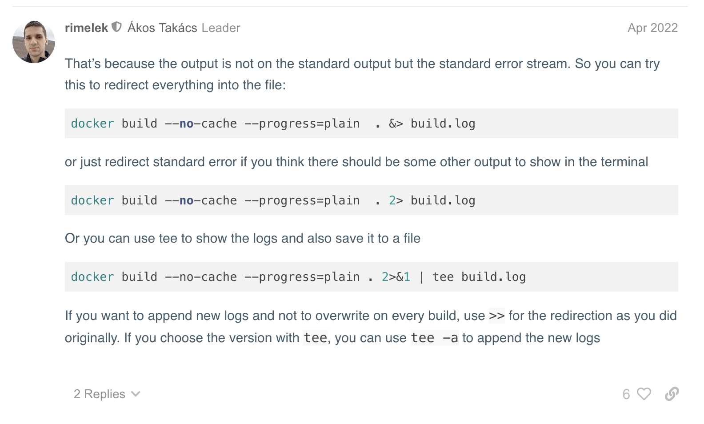

# Troubleshooting Demo

The goal of this demonstration is to create a Docker image that has R and the DESeq2 package, based from a Ubuntu image.

## Finding a Docker Image

- A Docker image needs to be found to base the image off of.
- Best places to look:
    - [Docker Hub](https://hub.docker.com/)
    - [RIS Supported Docker Image](https://docs.ris.wustl.edu/doc/compute/recipes/ris-supported-containers.html)
- Search Docker Hub to find an image. [Docker Hub Ubuntu Image](https://hub.docker.com/layers/library/ubuntu/jammy/images/sha256-0eb0f877e1c869a300c442c41120e778db7161419244ee5cbc6fa5f134e74736?context=explore)
- Search RIS docs to find an image. [RIS Ubuntu Image](https://docs.ris.wustl.edu/doc/compute/recipes/tools/novnc-dockerimage.html#available-versions)


## Creating the Docker Image

- Create a Dockerfile using the image as a base. (Using base ubuntu image as the example)
```
#Use Ubuntu 22.04 as base
FROM ubuntu:22.04
```
- Find out how to install R in a Docker image.


```
#Install R
RUN apt-get update && apt-get install -y r-base
```
- Now that R is installed, the image can be built.
- We need to run the following command from within the same folder/directory as the Dockerfile.
```
docker build -t elynrfw/docker-example:09-19-24 .
```

- It looks like the installation of R is asking for a region, but we can't respond to this and the image creation gets stuck.
- How do we fix this?


- Let's add that to our command.
```
RUN apt-get update && DEBIAN_FRONTEND=noninteractive apt-get install -y r-base
```
- Now we can try again.

- The output from Docker is in a kind of short form. Can we see more? What if there's an error and we need to know more?
- Let's start with the Docker build help info.
```
Flag shorthand -h has been deprecated, please use --help
Start a build

Usage:  docker buildx build [OPTIONS] PATH | URL | -

Start a build

Aliases:
  docker buildx build, docker buildx b

Options:
      --add-host strings              Add a custom host-to-IP mapping (format: "host:ip")
      --allow strings                 Allow extra privileged entitlement (e.g., "network.host", "security.insecure")
      --annotation stringArray        Add annotation to the image
      --attest stringArray            Attestation parameters (format: "type=sbom,generator=image")
      --build-arg stringArray         Set build-time variables
      --build-context stringArray     Additional build contexts (e.g., name=path)
      --builder string                Override the configured builder instance (default "desktop-linux")
      --cache-from stringArray        External cache sources (e.g., "user/app:cache", "type=local,src=path/to/dir")
      --cache-to stringArray          Cache export destinations (e.g., "user/app:cache", "type=local,dest=path/to/dir")
      --cgroup-parent string          Set the parent cgroup for the "RUN" instructions during build
  -f, --file string                   Name of the Dockerfile (default: "PATH/Dockerfile")
      --iidfile string                Write the image ID to a file
      --label stringArray             Set metadata for an image
      --load                          Shorthand for "--output=type=docker"
      --metadata-file string          Write build result metadata to a file
      --network string                Set the networking mode for the "RUN" instructions during build (default "default")
      --no-cache                      Do not use cache when building the image
      --no-cache-filter stringArray   Do not cache specified stages
  -o, --output stringArray            Output destination (format: "type=local,dest=path")
      --platform stringArray          Set target platform for build
      --progress string               Set type of progress output ("auto", "plain", "tty"). Use plain to show container output (default "auto")
      --provenance string             Shorthand for "--attest=type=provenance"
      --pull                          Always attempt to pull all referenced images
      --push                          Shorthand for "--output=type=registry"
  -q, --quiet                         Suppress the build output and print image ID on success
      --sbom string                   Shorthand for "--attest=type=sbom"
      --secret stringArray            Secret to expose to the build (format: "id=mysecret[,src=/local/secret]")
      --shm-size bytes                Shared memory size for build containers
      --ssh stringArray               SSH agent socket or keys to expose to the build (format: "default|<id>[=<socket>|<key>[,<key>]]")
  -t, --tag stringArray               Name and optionally a tag (format: "name:tag")
      --target string                 Set the target build stage to build
      --ulimit ulimit                 Ulimit options (default [])

Experimental commands and flags are hidden. Set BUILDX_EXPERIMENTAL=1 to show them.

What's Next?
  View a summary of image vulnerabilities and recommendations → docker scout quickview
```
- Looking at the help, we can see that the `--progress` option is going to give us what we want if we set it to plain.
- Let's try that and look at the difference.
```
docker build --progress=plain -t elynrfw/docker-example:09-19-24 .
```

- As we can see here, Docker uses a caching system to save on time and space.
- We don't necessarily want that when we're building an image, how do we change it?
- Looking back at the build options, we can see that there's an option for that.
```
--no-cache                      Do not use cache when building the image
```
- Let's add that to our build command.
```
docker build --progress=plain --no-cache -t elynrfw/docker-example:08-13-24 .
```

- There's a lot of output from this, but it's all necessary if we want to troubleshoot and debug.
- We could try piping the standard out to a log file.
```
docker build --progress=plain --no-cache -t elynrfw/docker-example:08-13-24 . > build.log
```
- As we can see from the output, this did not work.

- Let's see if there's a way to make this work.


- Based off what we found, our Docker build command should now look like the following.
```
docker build --progress=plain --no-cache -t elynrfw/docker-example:08-13-24 . &> build.log
```
- If we try that out, we can see that the output is now going to a file like we wanted.

- Once the build finishes, we can look at our `build.log` file.


## Expanding the Base Image

- Let's say we want to add an R package to our image.
- We know how to do this in R.
```
install.packages()
```
- But how do we make it work in Docker? Let's search!


- We've found out how to install a package in Docker, let's add it to our image.
```
#Install DeSeq2
RUN R -e "install.packages('deseq2',dependencies=TRUE, repos='http://cran.rstudio.com/')"
```
- Let's run our Docker build.
- Once it is finished we can take a look at our log. We specifically want to see the section about installing DESeq2.
```
#7 [3/3] RUN R -e "install.packages('deseq2',dependencies=TRUE, repos='http://cran.rstudio.com/')"
#7 0.638
#7 0.638 R version 4.1.2 (2021-11-01) -- "Bird Hippie"
#7 0.638 Copyright (C) 2021 The R Foundation for Statistical Computing
#7 0.638 Platform: x86_64-pc-linux-gnu (64-bit)
#7 0.638
#7 0.638 R is free software and comes with ABSOLUTELY NO WARRANTY.
#7 0.638 You are welcome to redistribute it under certain conditions.
#7 0.638 Type 'license()' or 'licence()' for distribution details.
#7 0.638
#7 0.638 R is a collaborative project with many contributors.
#7 0.638 Type 'contributors()' for more information and
#7 0.638 'citation()' on how to cite R or R packages in publications.
#7 0.638
#7 0.638 Type 'demo()' for some demos, 'help()' for on-line help, or
#7 0.638 'help.start()' for an HTML browser interface to help.
#7 0.638 Type 'q()' to quit R.
#7 0.638
#7 1.091 > install.packages('deseq2',dependencies=TRUE, repos='http://cran.rstudio.com/')
#7 1.094 Installing package into '/usr/local/lib/R/site-library'
#7 1.094 (as 'lib' is unspecified)
#7 7.614 Warning message:
#7 7.614 package 'deseq2' is not available for this version of R
#7 7.614
#7 7.614 A version of this package for your version of R might be available elsewhere,
#7 7.614 see the ideas at
#7 7.614 https://cran.r-project.org/doc/manuals/r-patched/R-admin.html#Installing-packages
#7 7.614 >
#7 7.614 >
#7 DONE 7.7s
```
- From the log, we can see that R did not find the package.
- To the Google!


- Based off the information here, we need to install Biocmanager and use that to install DESeq2.
- Our install code should now look like the following.
```
#Install DeSeq2
RUN R -e "install.packages('biocmanager',dependencies=TRUE, repos='http://cran.rstudio.com/')"
RUN R -e "BiocManager::install('DESeq2')"
```
- Try to build with the new Dockerfile.
```
docker build --progress=plain --no-cache -t elynrfw/docker-example:08-13-24 . &> build.log
```
- Note, that as we change our Dockerfile, we don't have to change our build command.
- Let's take a look at the log.
- At the end of the file, we can see a list of errors.
```
#8 480.7 ERROR: dependency 'GenomeInfoDb' is not available for package 'Biostrings'
#8 480.7 * removing '/usr/local/lib/R/site-library/Biostrings'
#8 481.2 ERROR: dependency 'GenomeInfoDb' is not available for package 'GenomicRanges'
#8 481.2 * removing '/usr/local/lib/R/site-library/GenomicRanges'
#8 481.4 ERROR: dependencies 'httr', 'Biostrings' are not available for package 'KEGGREST'
#8 481.4 * removing '/usr/local/lib/R/site-library/KEGGREST'
#8 481.8 ERROR: dependencies 'GenomicRanges', 'GenomeInfoDb' are not available for package 'SummarizedExperiment'
#8 481.8 * removing '/usr/local/lib/R/site-library/SummarizedExperiment'
#8 482.6 ERROR: dependency 'KEGGREST' is not available for package 'AnnotationDbi'
#8 482.6 * removing '/usr/local/lib/R/site-library/AnnotationDbi'
#8 483.0 ERROR: dependencies 'AnnotationDbi', 'XML', 'httr' are not available for package 'annotate'
#8 483.0 * removing '/usr/local/lib/R/site-library/annotate'
#8 483.3 ERROR: dependencies 'AnnotationDbi', 'annotate' are not available for package 'genefilter'
#8 483.3 * removing '/usr/local/lib/R/site-library/genefilter'
#8 483.6 ERROR: dependencies 'annotate', 'AnnotationDbi' are not available for package 'geneplotter'
#8 483.6 * removing '/usr/local/lib/R/site-library/geneplotter'
#8 484.1 ERROR: dependencies 'GenomicRanges', 'SummarizedExperiment', 'genefilter', 'geneplotter' are not available for package 'DESeq2'
#8 484.1 * removing '/usr/local/lib/R/site-library/DESeq2'
```
- It looks like a lot of dependencies that DESeq2 needs are not installing properly.
- We can find each section that has an error by running a cat piped into a grep.
```
cat build.log | grep "ERROR"
```
- Running this, we can see many sections that have an error.
```
#7 133.1 -------------------------- [ERROR MESSAGE] ---------------------------
#7 133.1 ERROR: configuration failed for package 'curl'
#8 78.80 -------------------------- [ERROR MESSAGE] ---------------------------
#8 78.80 ERROR: configuration failed for package 'curl'
#8 105.2 ERROR: configuration failed for package 'XML'
#8 221.5 ERROR: configuration failed for package 'RCurl'
#8 289.9 -------------------------- [ERROR MESSAGE] ---------------------------
#8 289.9 ERROR: configuration failed for package 'openssl'
#8 419.9 ERROR: dependencies 'curl', 'openssl' are not available for package 'httr'
#8 420.5 ERROR: dependency 'RCurl' is not available for package 'GenomeInfoDb'
#8 480.7 ERROR: dependency 'GenomeInfoDb' is not available for package 'Biostrings'
#8 481.2 ERROR: dependency 'GenomeInfoDb' is not available for package 'GenomicRanges'
#8 481.4 ERROR: dependencies 'httr', 'Biostrings' are not available for package 'KEGGREST'
#8 481.8 ERROR: dependencies 'GenomicRanges', 'GenomeInfoDb' are not available for package 'SummarizedExperiment'
#8 482.6 ERROR: dependency 'KEGGREST' is not available for package 'AnnotationDbi'
#8 483.0 ERROR: dependencies 'AnnotationDbi', 'XML', 'httr' are not available for package 'annotate'
#8 483.3 ERROR: dependencies 'AnnotationDbi', 'annotate' are not available for package 'genefilter'
#8 483.6 ERROR: dependencies 'annotate', 'AnnotationDbi' are not available for package 'geneplotter'
#8 484.1 ERROR: dependencies 'GenomicRanges', 'SummarizedExperiment', 'genefilter', 'geneplotter' are not available for package 'DESeq2'
```
- The numbers at the beginning of the line give the section and subsection. We can grep for those to figure out the error.
```
cat build.log | grep "#7 133.1"
#7 133.1 Using PKG_CFLAGS=
#7 133.1 Using PKG_LIBS=-lcurl
#7 133.1 --------------------------- [ANTICONF] --------------------------------
#7 133.1 Configuration failed because libcurl was not found. Try installing:
#7 133.1  * deb: libcurl4-openssl-dev (Debian, Ubuntu, etc)
#7 133.1  * rpm: libcurl-devel (Fedora, CentOS, RHEL)
#7 133.1 If libcurl is already installed, check that 'pkg-config' is in your
#7 133.1 PATH and PKG_CONFIG_PATH contains a libcurl.pc file. If pkg-config
#7 133.1 is unavailable you can set INCLUDE_DIR and LIB_DIR manually via:
#7 133.1 R CMD INSTALL --configure-vars='INCLUDE_DIR=... LIB_DIR=...'
#7 133.1 -------------------------- [ERROR MESSAGE] ---------------------------
#7 133.1 <stdin>:1:10: fatal error: curl/curl.h: No such file or directory
#7 133.1 compilation terminated.
#7 133.1 --------------------------------------------------------------------
#7 133.1 ERROR: configuration failed for package 'curl'
#7 133.1 * removing '/usr/local/lib/R/site-library/curl'
```
- From this, we can see that the first error shows that we need a library installed.
- It even tells us what library to install.
```
#7 133.1  * deb: libcurl4-openssl-dev (Debian, Ubuntu, etc)
```
- We can add that to our Dockerfile in the following line.
```
RUN apt-get update && DEBIAN_FRONTEND=noninteractive apt-get install -y r-base libcurl4-openssl-dev
```
- Let's run the build again.
- Once it's done we can use the grep for "ERROR" again to see what exists yet.
```
#8 99.11 ERROR: configuration failed for package 'XML'
#8 290.5 -------------------------- [ERROR MESSAGE] ---------------------------
#8 290.5 ERROR: configuration failed for package 'openssl'
#8 429.0 ERROR: dependency 'openssl' is not available for package 'httr'
#8 541.4 ERROR: dependency 'httr' is not available for package 'KEGGREST'
#8 560.7 ERROR: dependency 'KEGGREST' is not available for package 'AnnotationDbi'
#8 561.1 ERROR: dependencies 'AnnotationDbi', 'XML', 'httr' are not available for package 'annotate'
#8 561.5 ERROR: dependencies 'AnnotationDbi', 'annotate' are not available for package 'genefilter'
#8 561.8 ERROR: dependencies 'annotate', 'AnnotationDbi' are not available for package 'geneplotter'
#8 562.2 ERROR: dependencies 'genefilter', 'geneplotter' are not available for package 'DESeq2'
```
- Just that 1 additional library fixed a few of the errors.
- Let's take a look at the error for XML, `#8 99.11`.
```
cat build.log | grep "#8 99.11"
#8 99.11 ERROR: configuration failed for package 'XML'
#8 99.11 * removing '/usr/local/lib/R/site-library/XML'
```
- There's not a lot there but we can just grep for  `#8 99` and see if that expands the info.
```
#8 99.04 checking how to run the C preprocessor... gcc -E
#8 99.09 checking for sed... /bin/sed
#8 99.09 checking for pkg-config... /usr/bin/pkg-config
#8 99.09 checking for xml2-config... no
#8 99.10 Cannot find xml2-config
#8 99.11 ERROR: configuration failed for package 'XML'
#8 99.11 * removing '/usr/local/lib/R/site-library/XML'
#8 99.35 * installing *source* package 'xtable' ...
#8 99.35 ** package 'xtable' successfully unpacked and MD5 sums checked
#8 99.35 ** using staged installation
#8 99.36 ** R
#8 99.37 ** data
#8 99.37 ** inst
#8 99.37 ** byte-compile and prepare package for lazy loading
```
- Now we can see that it's looking for `xml2-config` but can't find it and it doesn't tell us what to install.
- To Google!


- From this, we can see that we need another library. So we can update our command to include it.
```
RUN apt-get update && DEBIAN_FRONTEND=noninteractive apt-get install -y r-base libcurl4-openssl-dev libxml2-dev
```
- Run the build again!
- If we grep for ERROR, we can see that the XML error is gone but we still have a few.
- If we look closer, we can see that some of them rely on each other. Let's take a look at the `openssl` error.
```
cat build.log | grep "#8 302.1"
#8 302.1 Using PKG_CFLAGS=
#8 302.1 --------------------------- [ANTICONF] --------------------------------
#8 302.1 Configuration failed because openssl was not found. Try installing:
#8 302.1  * deb: libssl-dev (Debian, Ubuntu, etc)
#8 302.1  * rpm: openssl-devel (Fedora, CentOS, RHEL)
#8 302.1  * csw: libssl_dev (Solaris)
#8 302.1  * brew: openssl (Mac OSX)
#8 302.1 If openssl is already installed, check that 'pkg-config' is in your
#8 302.1 PATH and PKG_CONFIG_PATH contains a openssl.pc file. If pkg-config
#8 302.1 is unavailable you can set INCLUDE_DIR and LIB_DIR manually via:
#8 302.1 R CMD INSTALL --configure-vars='INCLUDE_DIR=... LIB_DIR=...'
#8 302.1 -------------------------- [ERROR MESSAGE] ---------------------------
#8 302.1 tools/version.c:1:10: fatal error: openssl/opensslv.h: No such file or directory
#8 302.1     1 | #include <openssl/opensslv.h>
#8 302.1       |          ^~~~~~~~~~~~~~~~~~~~
#8 302.1 compilation terminated.
#8 302.1 --------------------------------------------------------------------
#8 302.1 ERROR: configuration failed for package 'openssl'
#8 302.1 * removing '/usr/local/lib/R/site-library/openssl'
```
- From this we can see that we need to install another library.
- Our install code should now look like the following.
```
RUN apt-get update && DEBIAN_FRONTEND=noninteractive apt-get install -y r-base libcurl4-openssl-dev libxml2-dev libssl-dev
```
- Add that and run the build again.
- Then we check for errors once again.
```
cat build.log | grep "ERROR"
```
- No errors were reported that were seen with "ERROR". Let's check the whole file.
```
#8 704.4 * DONE (DESeq2)
#8 704.4
#8 704.4 The downloaded source packages are in
#8 704.4 	'/tmp/RtmpSfpnVH/downloaded_packages'
#8 706.6 Old packages: 'KernSmooth', 'boot', 'class', 'cluster', 'codetools', 'foreign',
#8 706.6   'lattice', 'mgcv', 'nlme', 'nnet', 'rpart', 'spatial', 'survival'
#8 706.6 >
#8 706.6 >
#8 DONE 707.4s

#9 exporting to image
#9 exporting layers
#9 exporting layers 14.1s done
#9 writing image sha256:6c434002b550427b0b98498d65e191768019a9f165540e8a66845a5f512086d2
#9 writing image sha256:6c434002b550427b0b98498d65e191768019a9f165540e8a66845a5f512086d2 done
#9 naming to docker.io/elynrfw/docker-example:08-13-24 0.0s done
#9 DONE 14.1s

What's Next?
  View a summary of image vulnerabilities and recommendations → docker scout quickview
```
- We can see that DESeq2 installed correctly and there were no errors listed after that.
- Congratulations! We have made it through all the troubleshooting required to create a Docker image with R and DESeq2.
